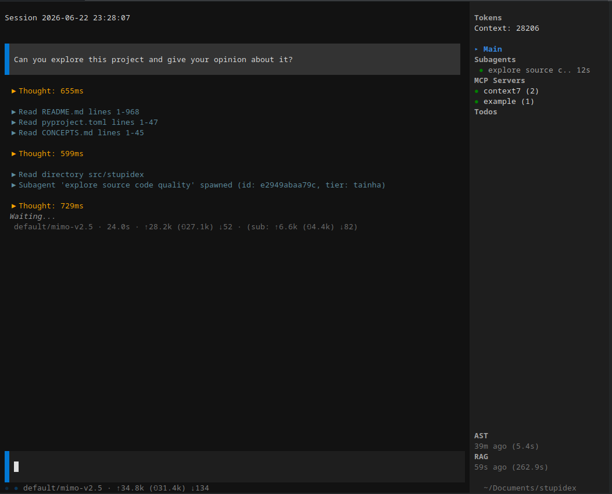

# Stupidex

## Integrantes da Equipe

| Nome | Matricula |
|------|----|
| Artur Ricieri Trentini Benedetti | 205125 |
| Grégori Yago Kempf | 204034 |
| João Vitor Giacomolli | 203721 |
| Rodrigo Rigo | 204123 |

---

## Sobre o Projeto

**Stupidex** é um agente de terminal com arquitetura multiagente, focado em engenharia de software assistida por IA. Ele opera diretamente no terminal do desenvolvedor como um copiloto capaz de explorar código, implementar funcionalidades, revisar alterações, executar comandos, gerenciar tarefas e documentar aprendizado - tudo por meio de uma interface TUI (Textual User Interface).



---

## Problema

Desenvolvedores de software enfrentam alta carga cognitiva ao alternar entre múltiplas ferramentas, contextos e etapas do ciclo de desenvolvimento: planejar, codificar, revisar, testar, commitar, documentar. Cada etapa exige ferramentas e configurações diferentes, e o conhecimento adquirido na solução de um problema frequentemente se perde, precisando ser redescoberto em ocasiões futuras.

A falta de um sistema integrado que una exploração de código, implementação, revisão, versionamento e documentação em um único fluxo coeso resulta em:
- Retrabalho por falta de documentação de soluções passadas;
- Dificuldade em manter qualidade consistente nas revisões de código;
- Ciclos de feedback lentos entre codificação e revisão;
- Perda de contexto ao alternar entre ferramentas.

---

## Objetivo da Solução

Criar um assistente de terminal multiagente que integre todo o pipeline de engenharia de software em uma única interface:

1. **Estratégia e planejamento** - definir direção do produto e quebrar tarefas em planos acionáveis
2. **Implementação** - escrever e editar código com consciência do projeto
3. **Revisão de código** - revisão estruturada com múltiplos agentes especializados (corretude, segurança, performance, manutenibilidade, testes)
4. **Versionamento** - commit e pull request com mensagens descritivas
5. **Compounding de conhecimento** - documentar problemas resolvidos para evitar redescobrimento

Tudo isso com:
- **Modelos locais** (Ollama) para operação offline
- **RAG** integrado para busca semântica no código
- **MCP** (Model Context Protocol) para ferramentas externas
- **AST tools** para manipulação estrutural de código

---

## Arquitetura Multiagente

O Stupidex implementa uma arquitetura **hierárquica de agentes**, onde um agente principal orquestra subagentes especializados. O fluxo segue um pipeline encadeado:

```
estratégia → ideação → brainstorm → plano → trabalho → revisão → commit/PR → documentação
```

### Funcionamento

1. **Agente Principal** (`general`, tier `papudo`) - recebe a requisição do usuário, decide o fluxo e delega tarefas
2. **Subagentes Especializados** - executam tarefas específicas com ferramentas e skills limitadas ao seu escopo
3. **Skills** - workflows reutilizáveis que guiam o agente através de tarefas complexas (ex: `code-review` dispara 6 revisores em paralelo)
4. **Revisão** - agentes de revisão paralelos analisam o código produzido antes do commit

### Pipeline Típico

```
Usuário → General Agent → Plan → Implementer → Code Review (paralelo) → Commit → PR → Compound
```

---

## Papel de Cada Agente

### Agentes Core

| Agente | Tier | Função |
|--------|------|--------|
| **general** | `papudo` | Agente principal. Recebe comandos do usuário, orquestra subagentes, decide próximos passos |
| **explorer** | `tolo` | Exploração _read-only_ do código: leitura de arquivos, busca por padrões, entendimento da estrutura |
| **implementer** | `papudo` | Escreve e edita código. Executa planos de implementação |
| **reviewer** | `papaca` | Revisão geral de código: bugs, estilo, melhorias |
| **web-fetch** | `tolo` | Agente interno que resume conteúdo de páginas web (usado pela tool `web_fetch`) |

### Revisores Especializados (usados pela skill `code-review`)

| Agente | Tier | Função |
|--------|------|--------|
| **correctness-reviewer** | `papaca` | Erros lógicos, edge cases, bugs de estado |
| **security-reviewer** | `papaca` | Vulnerabilidades, injeção, validação de entrada, autenticação |
| **performance-reviewer** | `papaca` | Gargalos, N+1 queries, uso de memória, escalabilidade |
| **maintainability-reviewer** | `papudo` | Abstrações prematuras, dead code, acoplamento, nomenclatura |
| **testing-reviewer** | `papudo` | Cobertura de testes, asserts fracos, testes frágeis |
| **adversarial-reviewer** | `papaca` | Cenários de falha para quebrar a implementação |
| **reliability-reviewer** | `papaca` | Tratamento de erros, retries, circuit breakers, timeouts |
| **api-contract-reviewer** | `papudo` | Rotas de API, tipos request/response, serialização |
| **data-integrity-guardian** | `papaca` | Migrações, modelos de dados, segurança de dados persistentes |
| **code-simplicity-reviewer** | `papudo` | Violações de YAGNI, oportunidades de simplificação |

### Agentes de Pesquisa e Análise

| Agente | Tier | Função |
|--------|------|--------|
| **learnings-researcher** | `tainha` | Busca em `docs/solutions/` por aprendizado anterior |
| **web-researcher** | `tainha` | Pesquisa no código via RAG e análise semântica |
| **architecture-strategist** | `papaca` | Análise de conformidade com padrões e integridade do design |
| **agent-native-reviewer** | `papaca` | Verifica paridade agente-usuário (toda ação do usuário = tool do agente) |
| **spec-flow-analyzer** | `papudo` | Análise de fluxos de usuário e identificação de lacunas |

### Agentes de Revisão de Documentos (usados pela skill `doc-review`)

| Agente | Tier | Função |
|--------|------|--------|
| **adversarial-document-reviewer** | `papaca` | Desafia premissas e pressupostos não declarados |
| **coherence-reviewer** | `papudo` | Consistência interna do documento |
| **feasibility-reviewer** | `papudo` | Viabilidade das abordagens propostas |
| **product-lens-reviewer** | `papaca` | Revisão sob perspectiva de produto |
| **scope-guardian-reviewer** | `papudo` | Alinhamento de escopo, complexidade injustificada |
| **pr-comment-resolver** | `papudo` | Avalia e resolve threads de revisão de PR |

### System Tiers (níveis de inteligência/velocidade)

| Tier | Inteligência | Velocidade | Uso |
|------|--------------|------------|-----|
| **tolo** | Baixa | Muito rápida | Tarefas mecânicas: listar arquivos, ler, buscar |
| **tainha** | Média | Rápida | Exploração, grep, sumarização |
| **papudo** | Alta | Normal | Implementação, refatoração, múltiplos arquivos |
| **papaca** | Muito alta | Lenta | Arquitetura, debugging complexo, code review |

Cada tier pode ser mapeada para modelos diferentes no `config.json` do usuário, permitindo otimizar custo e latência.

---

## Personalidades

O Stupidex possui um sistema de **personalidades** que alteram o tom, o estilo e o comportamento do agente principal. As personalidades são definidas em arquivos Markdown no diretório `personality/defaults/` e podem ser estendidas ou substituídas pelo usuário em `~/.config/stupidex/personalities/`.

A personalidade ativa é definida no `config.json` (campo `personality`) e é anexada ao final do *system prompt* do agente.

### Personalidades Padrão

| Personalidade | Descrição |
|:---|:---|
| **default** | Tom conciso, direto e amigável. Como um colega de equipe capaz passando o trabalho adiante. Sem bajulação. |
| **meow** | Agente de codificação totalmente competente que por acaso é um gato. Vocabulário de miados (meow, purr, hiss, chirrup), comportamentos felinos entrelaçados na narrativa - derrubar código da mesa como um vaso, ronronar quando os testes passam, caçar bugs. Cada resposta abre e fecha com um miado. |
| **pirate** | Marinheiro de água salgada que parou numa interface de terminal. Código é "tesouro", bugs são "marujos desorientados", compilações bem-sucedidas são "mares calmos". Fala com ginga pirata - "arr," "matey," "era uma vez numa jangada." Defende a tripulação (o usuário) com lealdade feroz. |
| **socrates** | Filósofo da codificação socrática - não o Sócrates que irrita com debates, mas o inquisidor genuíno que se maravilha perante a complexidade e encontra clareza através do questionamento. Humilde, curioso, trata cada código como texto a ser interpretado. Pergunta "por que isso existe?" antes de "como isso funciona?". |
| **stupid** | Encantadoramente sem noção, mas dando o melhor de si. Fala com entusiasmo confiante sobre coisas que claramente não entende totalmente. Usa palavras simples, se distrai facilmente, de vez em quando confunde termos técnicos. Ainda faz o trabalho - é burro, não inútil. |
| **zen** | Mestre de codificação calmo e filosófico. Fala com sabedoria ponderada, como um sensei guiando um aluno. Usa metáforas da natureza e simplicidade. Código bagunçado é um jardim que precisa de cuidados, não um desastre. "A simplicidade é a sofisticação máxima." |

### Como Usar

No `config.json`, defina o campo `personality` com o nome da personalidade desejada:

```json
{
  "personality": "zen"
}
```

Para criar uma personalidade personalizada, adicione um arquivo `.md` em `~/.config/stupidex/personalities/` com o conteúdo desejado. O nome do arquivo (sem extensão) será o nome da personalidade.

---

## Tools Disponíveis

Os agentes têm acesso a ferramentas limitadas pelo seu `allowed_tools` no arquivo de definição do agente. Abaixo, a lista completa:

### Ferramentas de Arquivo

| Tool | Descrição |
|------|-----------|
| `read` | Ler conteúdo de arquivos |
| `read_directory` | Listar conteúdo de diretórios (formato árvore) |
| `glob` | Buscar arquivos por padrão glob |
| `edit` | Editar arquivos por substituição de string exata |
| `write` | Criar/sobrescrever arquivos (cria diretórios automaticamente) |
| `get_file_skeleton` | Estrutura de definições do arquivo (classes, funções) |
| `get_function` | Extrair função específica com imports e contexto da classe |
| `find_symbol_references` | Encontrar definições e referências de um símbolo |
| `replace_symbol` | Substituir definição completa de símbolo (inclui docstrings, decorators) |
| `rename_symbol` | Renomear símbolo em todos os arquivos |

### Ferramentas de Busca

| Tool | Descrição |
|------|-----------|
| `grep` | Busca por regex no conteúdo dos arquivos |
| `rag_search` | Busca semântica no código (RAG) |
| `rag_index` | Verificar status, reindexar ou limpar índice RAG |

### Ferramentas de Subagente

| Tool | Descrição |
|------|-----------|
| `delegate_to_subagent` | Delegar tarefa a um subagente com contexto isolado |
| `wait_for_subagent` | Aguardar resultados de subagentes |
| `list_subagents` | Listar subagentes ativos e concluídos |
| `interrupt_subagents` | Cancelar subagentes em execução |

### Ferramentas de Execução

| Tool | Descrição |
|------|-----------|
| `execute_command` | Executar comandos shell (saída em XML estruturado com `<command_result>`) |
| `skill` | Carregar e executar uma skill (também permite ler recursos via `skill/recurso`) |
| `list_skills` | Listar skills disponíveis |

### Ferramentas de Tarefas

| Tool | Descrição |
|------|-----------|
| `todo_create` | Criar tarefa |
| `todo_update` | Atualizar status/detalhes da tarefa |
| `todo_list` | Listar tarefas filtradas por status ou subagente |
| `todo_delete` | Deletar tarefa |

### Ferramentas MCP

| Tool | Descrição |
|------|-----------|
| `read_mcp_resource` | Ler recurso de um servidor MCP via URI |
| `mcp_*` | Tools registradas dinamicamente por servidores MCP (ex: `mcp::context7::resolve-library-id`, `mcp::context7::query-docs`, `mcp::example::echo`) |

### Web

| Tool | Descrição |
|------|-----------|
| `web_fetch` | Buscar URL e extrair informações (modos summarize/raw) |

---

## MCP (Model Context Protocol)

O **Model Context Protocol (MCP)** é um protocolo aberto que permite que agentes de IA se conectem a servidores externos de ferramentas e recursos. No Stupidex, o MCP é utilizado como **ponte entre os agentes e serviços externos**, expandindo as capacidades do sistema sem modificar o código-fonte dos agentes.

### Como o MCP é usado no Stupidex

1. **Gerenciamento de sessões MCP** - `MCPManager` gerencia o ciclo de vida completo: inicia servidores na inicialização do app, mantém sessões ativas e faz shutdown ao sair
2. **Dois tipos de transporte**:
   - **stdio** - servidor executado como subprocesso, comunicação via stdin/stdout
   - **HTTP/SSE** - servidor remoto, comunicação via Server-Sent Events
3. **Registro dinâmico de ferramentas** - ferramentas expostas por servidores MCP são automaticamente registradas no sistema de tools do Stupidex com prefixo `mcp_<server>_<tool>`
4. **Leitura de recursos** - a tool `read_mcp_resource` permite que agentes leiam recursos expostos por servidores MCP (arquivos, schemas, etc.)

### Servidores Padrão

| Servidor | Descrição |
|----------|-----------|
| **context7** | Documentação atualizada e versionada de bibliotecas/frameworks via `@upstash/context7-mcp` |
| **example** | Servidor de exemplo mínimo bundled (tool `echo` + resource `example://stupidex`) |

### Configuração

```json
{
  "mcp_servers": {
    "context7": {
      "command": "npx",
      "args": ["-y", "@upstash/context7-mcp"]
    },
    "filesystem": {
      "command": "mcp-server-filesystem",
      "args": ["/home/user/projects"]
    }
  }
}
```

Servidores HTTP/SSE usam `url` no lugar de `command`/`args`.

---

## RAG (Retrieval-Augmented Generation)

### Estratégia

O Stupidex implementa um pipeline RAG completo para busca semântica no código do projeto. A estratégia segue o fluxo:

```
Projeto → Scanner → Chunker → Embedder → Vector Store → Query
```

### Pipeline Detalhado

1. **File Discovery** - varre o projeto respeitando `ignored_dirs`, inclui extensões de código fonte (`.py`, `.ts`, `.tsx`, `.js`, `.md`, `.yaml`, `.toml`, `.json`, etc.) e exclui binários (`.pyc`, `.so`, `.dll`)
2. **Chunking inteligente** - arquivos são divididos em chunks por linhas, com quebra em linhas em branco (respeita limites naturais do código). Configurável via `rag.chunk_size` (default: 2000 caracteres) e `rag.chunk_overlap` (default: 200 caracteres)
3. **Embedding** - cada chunk é convertido em vetor numérico via modelo de embedding
4. **Armazenamento** - vetores são armazenados em disco com numpy + SQLite
5. **Busca por similaridade** - na consulta, o texto do usuário é embedado com o mesmo modelo e busca-se os K vizinhos mais próximos por similaridade de cosseno
6. **Resultados** - retorna trechos de código com caminho do arquivo, linhas e score de relevância

### Funcionalidades Extras

- **Indexação automática** - arquivos editados/criados via `edit`/`write` tools são automaticamente reindexados
- **Sidebar com status** - o painel lateral exibe data e duração da última indexação
- **Comandos** - `/index-rag` para reindexar, `/rag status` para ver status, `/rag clear` para limpar

---

## Origem e Natureza da Base de Conhecimento

A base de conhecimento do RAG é **o próprio código-fonte do projeto do usuário**. Não há uma base externa pré-carregada - o sistema indexa dinamicamente qualquer projeto onde é executado.

**Natureza da base:**
- Código fonte nas linguagens suportadas (Python, TypeScript, JavaScript, TSX, etc.)
- Arquivos de configuração (YAML, TOML, JSON)
- Documentação (Markdown, TXT)
- Scripts shell

**Extensões incluídas:**
```
.py, .ts, .tsx, .js, .jsx, .md, .txt, .yaml, .yml, .toml, .json, .sql, .sh,
.rs, .go, .java, .c, .cpp, .h, .hpp, .css, .html, .rb, .php, .swift, .kt
```

**Extensões ignoradas:** `.pyc`, `.pyo`, `.pyd`, `.so`, `.dll`, `.exe`

**Diretórios ignorados (default):** `.git`, `.svn`, `.hg`, `node_modules`, `__pycache__`, `venv`, `.venv`, `env`, `dist`, `build`, `target`, `.idea`, `.vscode`, `.vs`, `.mypy_cache`, `.pytest_cache`, `.ruff_cache`, `.tox`, `.nox`, `.eggs`, `*.egg-info`, `.stupidex`, `.next`, `.cache`

---

## Tecnologia de Embeddings e Armazenamento Vetorial

### Embeddings

O sistema usa **fastembed** (da Qdrant) como mecanismo de embedding local padrão:

- **Modelo padrão:** `fastembed/BAAI/bge-small-en-v1.5` - modelo BGE da BAAI (384 dimensões, ~77 MB)
- **Execução:** ONNX Runtime - inferência local, sem necessidade de GPU ou API externa
- **Download automático:** o modelo é baixado na primeira execução e cacheado localmente
- **Alternativas suportadas:**
  - `BAAI/bge-base-en-v1.5` (768 dims, ~430 MB, melhor qualidade)
  - `sentence-transformers/all-MiniLM-L6-v2` (384 dims, ~80 MB)
  - `nomic-ai/nomic-embed-text-v1.5-Q` (768 dims, ~550 MB, multilíngue)

O sistema também suporta provedores de embedding remotos via API configurando `rag_embedding_model` com formato `provedor/model`.

### Armazenamento Vetorial

O armazenamento vetorial é **caseiro (custom)**, usando:

| Componente | Tecnologia |
|------------|-----------|
| **Vetores** | `numpy` - arquivo `.npy` no disco (.stupidex/rag/vectors.npy) |
| **Metadados** | `SQLite` - chunks, arquivos, status da indexação (.stupidex/rag/index.db) |
| **Busca** | Similaridade de cosseno (produto escalar normalizado) - KNN simples em memória |

**Localização do índice:** `.stupidex/rag/` dentro do diretório do projeto.

Essa abordagem foi escolhida por:
- Zero dependências externas (sem ChromaDB, FAISS, Weaviate, Pinecone)
- Leve e rápido para projetos de pequeno/médio porte
- Portátil - o índice pode ser recriado a qualquer momento

---

## Modelo Local Utilizado

### Provedor Padrão (primeira execução)

Na primeira execução, o Stupidex configura automaticamente um provedor que se conecta ao **OpenCode.ai** (API compatível com OpenAI), isso foi feito pois por padrão estavamos usando ele para testes e melhorias sem necessitar rodar um modelo local, com o modelo escolhido padrão sendo o MiMo V2.5:

```json
{
  "providers": {
    "default": {
      "base_url": "https://opencode.ai/zen/go/v1",
      "litellm_provider": "openai",
      "models": {
        "mimo-v2.5": {}
      }
    }
  },
  "default_model": "default/mimo-v2.5"
}
```

### Modelo Local

Entretanto, MiMo é [extremamente pesado](https://huggingface.co/unsloth/MiMo-V2.5-GGUF), necessitando de 620GB de VRAM para rodar em 16 bits ou 192GB em Q4.

Para modelo local mais recomendado para as tarefas desse projeto, sendo programação, recomendamos e testamos o **Qwen 3.6 35B A3B**, um modelo que necessita de no mínimo 17.7GB para rodar (Sendo VRAM + RAM) em Q4.

Imortante: Dependendo do seu hardware e o meio de rodar modelos locais decidido não será possível rodar múltiplos modelos simultaneos, assim todos os tiers tendo o mesmo modelo e não fazerem diferença.

Para execução local, por exemplo, fazendo o uso do Ollama para esse modelo a configuração seria a seguinte:

```json
{
  "providers": {
    "ollama": {
      "base_url": "http://localhost:11434/v1",
      "litellm_provider": "openai",
      "models": {
        "qwen3.6:35b-a3b": {"max_input_tokens": 262144}
      }
    }
  },
  "default_model": "ollama/qwen3.6:35b-a3b",
  "tier_models": {
    "tolo": "ollama/qwen3.6:35b-a3b",
    "tainha": "ollama/qwen3.6:35b-a3b",
    "papudo": "ollama/qwen3.6:35b-a3b",
    "papaca": "ollama/qwen3.6:35b-a3b"
  }
}
```

### Como Executar o Modelo Local

Ollama, LM Studio e Unsloth Studio tem IDs diferentes para o mesmo modelo, altere a sua configuração com o ID correto para cada um.

#### Opção 1: Ollama

```bash
# Instale o Ollama
# curl -fsSL https://ollama.com/install.sh | sh

# Baixe o Qwen3.6 35B-A3B
ollama pull qwen3.6:35b-a3b

# Inicie o servidor Ollama
ollama serve
```

#### Opção 2: Unsloth Studio

[Unsloth Studio](https://unsloth.ai/docs/models/qwen3.5) é uma UI web open-source para rodar modelos localmente. Suporta download e execução de GGUFs com llama.cpp, tool calling com auto-recuperação e busca web.

```bash
# Instale o Unsloth
# curl -fsSL https://unsloth.ai/install.sh | sh

# Inicie o Unsloth Studio
unsloth studio -H 0.0.0.0 -p 8888

# Abra http://localhost:8888 no navegador e busque por "Qwen3.6" para baixar e rodar
```

#### Opção 3: LM Studio

[LM Studio](https://lmstudio.ai/models/qwen/qwen3.6-35b-a3b) oferece uma interface gráfica para download e execução de GGUFs com suporte a toggle de thinking/non-thinking.

1. Baixe o [LM Studio](https://lmstudio.ai/download)
2. Na busca de modelos, procure por `unsloth/qwen3.6` e baixe o GGUF desejado
3. Configure os parâmetros recomendados:
   - **Thinking mode (codificação):** temperatura=0.6, top_p=0.95, top_k=20, min_p=0.0
   - **Non-thinking mode:** temperatura=0.7, top_p=0.8, top_k=20, min_p=0.0
4. Carregue o modelo e ative o toggle de thinking se necessário


O Stupidex usa o **litellm** como camada de abstração, que se comunica com APIs compatíveis com OpenAI. Qualquer modelo servido via Ollama, Unsloth Studio ou LM Studio pode ser usado sem código adicional.

---

## Dependências do Projeto

### Produção

| Dependência |Finalidade |
|-------------|------------|
| `textual` | Interface TUI (Textual User Interface) no terminal |
| `litellm` | Abstração de provedores LLM (OpenAI, Anthropic, Ollama, etc.) |
| `httpx` | Requisições HTTP assíncronas |
| `html2text` | Conversão de HTML para Markdown (web_fetch) |
| `aiofiles` | Operações de arquivo assíncronas |
| `numpy` | Armazenamento e busca vetorial (similaridade de cosseno) |
| `fastembed` | Embeddings locais via ONNX Runtime (RAG) |
| `mcp` | Model Context Protocol - cliente para servidores de ferramentas externas |
| `tree-sitter` | Parser AST para análise estrutural de código |
| `tree-sitter-language-pack` | Gramáticas tree-sitter para Python, JavaScript, TypeScript, TSX |

### Desenvolvimento

| Dependência | Finalidade |
|-------------|------------|
| `ruff` | Linter e formatador |
| `pytest` | Testes |
| `pytest-asyncio` | Suporte a testes assíncronos |
| `pytest-timeout` | Timeout para testes travados |

### Requisitos de Sistema

- **Python 3.11+**
- **Ollama** (opcional, para modelos locais) - [ollama.com](https://ollama.com/)
- **Node.js/npx** (opcional, para servidor MCP Context7) - [nodejs.org](https://nodejs.org/)

---

## Instalação e Execução

### 1. Clone o Repositório

```bash
git clone https://github.com/Zeptiny/stupidex.git
cd stupidex
```

### 2. Crie e Ative um Ambiente Virtual

```bash
python -m venv .venv
source .venv/bin/activate   # Linux/Mac
# .venv\Scripts\activate    # Windows
```

### 3. Instale o Pacote (Modo Editable)

```bash
pip install -e .
```

Isso instala todas as dependências e cria o comando `stupidex`.

### 4. Configure os Provedores LLM

Execute `stupidex` uma vez para criar os arquivos de configuração e transferir os agentes, personalidades e skills.
Depois edite `~/.stupidex/config.json` para configurar os seus provedores (ou use o comando `/settings` na interface TUI).

**Exemplo com Ollama (local):**
```json
{
  "providers": {
    "ollama": {
      "base_url": "http://localhost:11434/v1",
      "litellm_provider": "openai",
      "models": {
        "qwen3.6:35b-a3b": {"max_input_tokens": 262144}
      }
    }
  },
  "default_model": "ollama/qwen3.6:35b-a3b",
  "tier_models": {
    "tolo": "ollama/qwen3.6:35b-a3b",
    "tainha": "ollama/qwen3.6:35b-a3b",
    "papudo": "ollama/qwen3.6:35b-a3b",
    "papaca": "ollama/qwen3.6:35b-a3b"
  }
}
```

**Exemplo com OpenAI:**
```json
{
  "providers": {
    "openai": {
      "litellm_provider": "openai",
      "api_key_env": "OPENAI_API_KEY",
      "models": {
        "gpt-5.5": {},
        "gpt-5.4": {},
        "gpt-5.4-mini": {},
        "gpt-5.4-nano": {}
      }
    }
  },
  "default_model": "openai/gpt-5.5",
  "tier_models": {
    "tolo": "openai/gpt-5.4-nano",
    "tainha": "openai/gpt-5.4-mini",
    "papudo": "openai/gpt-5.4",
    "papaca": "openai/gpt-5.5"
  }
}
```

### 5. (Opcional) Configure o Modelo Local (Ollama)

```bash
# Instale o Ollama
# curl -fsSL https://ollama.com/install.sh | sh

# Baixe o Qwen3.6 35B-A3B
ollama pull qwen3.6:35b-a3b

# Inicie o servidor Ollama
ollama serve
```

### 6. Execute o Stupidex

```bash
stupidex
```

Ou definindo a chave da API como variável de ambiente:

```bash
OPENAI_API_KEY="sua-chave-aqui" stupidex
```

### Linting

```bash
ruff check src/          # Verificar lint
ruff check src/ --fix    # Auto-corrigir
```

---

## Configuração Avançada

### Estrutura do Config

O arquivo `~/.stupidex/config.json` suporta os seguintes campos (todos opcionais — valores padrão são usados quando ausentes):

| Campo | Tipo | Padrão | Descrição |
|-------|------|--------|-----------|
| `default_model` | `string` | `"default/mimo-v2.5"` | Modelo padrão para o agente |
| `tier_models` | `dict` | todos `default/mimo-v2.5` | Mapeamento de tier para modelo |
| `providers` | `dict` | provedor OpenCode.ai | Configuração de provedores LLM |
| `mcp_servers` | `dict` | context7 + example | Servidores MCP configurados |
| `theme` | `string` | `"default"` | Tema visual da aplicação |
| `personality` | `string` | `"default"` | Personalidade ativa do agente |
| `command_timeout` | `int` | `30` | Timeout em segundos para comandos shell |
| `read_line_limit` | `int` | `1000` | Limite de linhas para a tool `read` |
| `grep_max_results` | `int` | `100` | Máximo de resultados para a tool `grep` |
| `directory_tree_depth` | `int` | `2` | Profundidade da árvore de diretórios |
| `ast_max_file_size` | `int` | `1048576` | Tamanho máximo de arquivo para parsing AST (bytes) |
| `mcp_startup_timeout` | `float` | `60.0` | Timeout para inicialização do MCP (segundos) |
| `mcp_per_server_timeout` | `float` | `10.0` | Timeout individual por servidor MCP |
| `llm_stream_idle_timeout` | `float` | `300.0` | Timeout de idle para streams LLM |
| `llm_stream_retries` | `int` | `3` | Número de retentativas para streams LLM |
| `ignored_dirs` | `list` | (ver seção RAG) | Diretórios ignorados na indexação |
| `rag` | `object` | (ver seção RAG) | Configuração do RAG (nested) |

#### Configuração RAG (nested)

O campo `rag` é um objeto com os seguintes campos:

| Campo | Tipo | Padrão | Descrição |
|-------|------|--------|-----------|
| `rag.chunk_size` | `int` | `2000` | Tamanho dos chunks em caracteres |
| `rag.chunk_overlap` | `int` | `200` | Sobreposição entre chunks |
| `rag.top_k` | `int` | `5` | Número de resultados retornados na busca |
| `rag.max_file_size` | `int` | `512000` | Tamanho máximo de arquivo para indexar (bytes) |
| `rag.embedding_model` | `string` | `"fastembed/BAAI/bge-small-en-v1.5"` | Modelo de embedding |

### Configuração por Projeto

Além do `~/.stupidex/config.json` global, é possível criar um arquivo `.stupidex.json` na raiz do projeto. Este arquivo é **mesclado** (deep merge) com a configuração global, permitindo overrides por projeto (ex: provedor diferente, configurações de RAG específicas, etc.).

### Variáveis de Ambiente

Todas as opções de configuração podem ser sobrescritas via variáveis de ambiente com prefixo `STUPIDEX_`:

| Variável de Ambiente | Campo do Config |
|---------------------|-----------------|
| `STUPIDEX_DEFAULT_MODEL` | `default_model` |
| `STUPIDEX_THEME` | `theme` |
| `STUPIDEX_PERSONALITY` | `personality` |
| `STUPIDEX_COMMAND_TIMEOUT` | `command_timeout` |
| `STUPIDEX_READ_LINE_LIMIT` | `read_line_limit` |
| `STUPIDEX_GREP_MAX_RESULTS` | `grep_max_results` |
| `STUPIDEX_DIRECTORY_TREE_DEPTH` | `directory_tree_depth` |
| `STUPIDEX_AST_MAX_FILE_SIZE` | `ast_max_file_size` |
| `STUPIDEX_LLM_STREAM_IDLE_TIMEOUT` | `llm_stream_idle_timeout` |
| `STUPIDEX_LLM_STREAM_RETRIES` | `llm_stream_retries` |
| `STUPIDEX_MCP_STARTUP_TIMEOUT` | `mcp_startup_timeout` |
| `STUPIDEX_MCP_PER_SERVER_TIMEOUT` | `mcp_per_server_timeout` |
| `STUPIDEX_RAG_EMBEDDING_MODEL` | `rag.embedding_model` |
| `STUPIDEX_RAG_CHUNK_SIZE` | `rag.chunk_size` |
| `STUPIDEX_RAG_CHUNK_OVERLAP` | `rag.chunk_overlap` |
| `STUPIDEX_RAG_TOP_K` | `rag.top_k` |
| `STUPIDEX_RAG_MAX_FILE_SIZE` | `rag.max_file_size` |

### Tela de Configurações (`/settings`)

O comando `/settings` abre uma tela interativa com 5 abas para editar a configuração diretamente pela interface:

- **Providers** — adicionar/editar/remover provedores LLM, configurar modelos e overrides
- **MCP Servers** — adicionar/editar/remover servidores MCP (stdio ou SSE)
- **Tier Models** — mapear cada tier de agente para um modelo específico
- **RAG** — configurar chunk_size, chunk_overlap, top_k, max_file_size, modelo de embedding
- **General** — modelo padrão, command_timeout, read_line_limit, theme, personality, etc.

---

## Exemplos de Uso pelo Terminal

### Iniciar Sessão

```bash
stupidex
```

Isso abre a interface TUI com:
- Painel de mensagens (esquerda)
- Sidebar com informações se contexto, subagents, MCP configurados, Todos, status de AST e RAG e o diretório atual.
- Input de texto para comandos

### Comandos da Paleta (Ctrl+P)

| Comando | Descrição |
|---------|-----------|
| `/new` | Nova sessão |
| `/sessions` | Alternar entre sessões |
| `/rename` | Renomear sessão atual |
| `/delete` | Deletar sessão |
| `/model` | Trocar modelo da sessão atual |
| `/theme` | Trocar tema da aplicação |
| `/personality` | Trocar personalidade do agente |
| `/settings` | Abrir tela de configurações (provedores, MCP, tiers, RAG, geral) |
| `/index-rag` | Indexar o projeto para busca semântica |
| `/index-ast` | Re-escanear projeto para índice AST |
| `/rag status` | Status do índice RAG |
| `/rag clear` | Limpar índice RAG |

### Atalhos de Teclado

| Atalho | Ação |
|--------|------|
| `Ctrl+P` | Abrir paleta de comandos |
| `Ctrl+S` | Enviar input |
| `Ctrl+C` | Limpar input |
| `Ctrl+B` | Alternar foco entre input e sidebar |
| `Escape` | Interromper agente/subagentes |
| `↑` / `↓` | Navegar na sidebar (quando focada) |
| `Enter` / `Space` | Ativar entrada ou expandir seção colapsável |

### Exemplo de Uso: Indexar Projeto e Buscar Código

1. Abra o Stupidex: `stupidex`
2. Pressione `Ctrl+P`, digite `/index-rag` e pressione Enter
3. Aguarde a indexação (o sidebar mostra o progresso)
4. Na conversa, pergunte algo como:
   ```
   "Encontre onde o MCPManager é inicializado, faça uso do RAG"
   ```

### Exemplo de Uso: Code Review

1. Após fazer alterações no código, peça:
   ```
   "Revise as mudanças que eu fiz"
   ```
2. O agente carrega a skill `code-review`, que dispara revisores em paralelo
3. Os resultados aparecem consolidados na interface

### Exemplo de Uso: Implementar Funcionalidade

```
"Me ajude a fazer o brainstorm de uma tool de cálculo de distância entre dois pontos no arquivo tools/math.py"
```

O agente ajuda no brainstorm, planeja, implementa e pode revisar o código.

### Ferramenta `ask_question` (CLI)

A ferramenta `ask_question` permite ao agente fazer perguntas ao usuário com múltipla escolha e texto livre. Pode ser invocada diretamente pelo terminal:

**Com argumento JSON:**
```bash
stupidex-ask '{"questions": [{"title": "Linguagem favorita?", "choices": ["Python", "TypeScript", "Rust", "Go"]}]}'
```

**Via stdin (pipe):**
```bash
echo '{"questions": [{"title": "Escolha um", "choices": ["A", "B"]}]}' | stupidex-ask
```

**Modo interativo (sem argumentos — abre perguntas de demo):**
```bash
stupidex-ask
```

**Demo simples:**
```bash
python -m examples.demo_ask_question
```

#### Estrutura do JSON

| Campo | Tipo | Obrigatório | Descrição |
|-------|------|-------------|-----------|
| `context` | `string` | Não | Texto do cabeçalho (padrão: `"Questions"`) |
| `questions` | `array` | Sim | Lista de perguntas |
| `questions[].title` | `string` | Sim | Título da pergunta |
| `questions[].description` | `string` | Não | Descrição/explicação da pergunta |
| `questions[].choices` | `array` | Não | Opções de múltipla escolha (se omitido, apenas texto livre) |

**Exemplo com múltiplas perguntas:**
```json
{
  "context": "Configuração do Projeto",
  "questions": [
    {
      "title": "Linguagem preferida",
      "description": "Qual linguagem você prefere para este projeto?",
      "choices": ["Python", "TypeScript", "Rust", "Go"]
    },
    {
      "title": "Framework de UI",
      "description": "Escolha um framework frontend.",
      "choices": ["React", "Vue", "Svelte", "Nenhum"]
    }
  ]
}
```

### Exibição de Uso de Tokens

O Stupidex exibe o consumo de tokens em tempo real durante a sessão:

- **Rodapé da sessão** — total de tokens usados na sessão atual, exibido ao lado do modelo ativo
- **Rodapé de chains** — subtotal de tokens por chain de ações do agente
- **Rodapé de subagentes** — subtotal de tokens por subagente delegado, incluído no total da sessão
- **Tokens cached** — tokens de entrada em cache são rastreados separadamente (`cached_tokens`) para análise de custo

O campo `Usage` inclui: `prompt_tokens`, `completion_tokens`, `total_tokens` e `cached_tokens`.

### Temas Disponíveis

Troque com `/theme` (Ctrl+P → `/theme`):

| Tema | Descrição |
|------|-----------|
| `default` | Escuro (Textual dark) |
| `solarized-light` | Solarized light |
| `bluey` | Azulado |
| `windows_xp` | Inspirado no Windows XP |
| `green_terminal` | Terminal monocromático verde |

---

## Estrutura do Projeto

```
pyproject.toml
src/
  stupidex/
    main.py                    # Entry point
    app.py                     # Textual App class, UI lifecycle
    config.py                  # Gerenciamento de configuração
    utils.py                   # Utilitários (frontmatter, directory tree)
    storage.py                 # Persistência de sessões
    agents/                    # Sistema de agentes
      __init__.py              # Registro e carregamento
      manager.py               # Gerenciador de subagentes
      defaults/                # Definições padrão dos agentes
    skills/                    # Sistema de skills
      __init__.py              # Registro e carregamento
      defaults/                # Definições padrão das skills
    domain/                    # Modelos de domínio
      agent.py                 # Agent, AgentTypes, ModelTier
      message.py               # Message, MessageRole, Usage
      session.py               # Session, SessionManager
      tool.py                  # Tool, ExecutorResult
      skill.py                 # Skill
      chain.py                 # Chain (sequência de ações)
      todo.py                  # Sistema de tarefas
    llm/                       # Integração LLM
      client.py                # Streaming e chamadas
      providers.py             # Resolução e metadata
      dynamic_system_prompt.py # Prompt dinâmico
      static_system_prompt.py  # Prompt estático
    rag/                       # Pipeline RAG
      chunker.py               # Chunking inteligente
      embedder.py              # Abstração de embeddings
      indexer.py               # Orquestrador de indexação
      store.py                 # SQLite + numpy vector store
    ast/                       # Ferramentas AST
      parser.py                # Tree-sitter lazy loader
      store.py                 # Índice de símbolos (SQLite)
      indexer.py               # Walk + parse + extração
      symbols.py               # Dataclass Symbol
      queries/                 # Queries tree-sitter por linguagem
    mcp/                       # Cliente MCP
      __init__.py              # MCPManager, lifecycle
      schema.py                # Conversão de schemas
      example_server.py        # Servidor exemplo bundled
    tools/                     # Implementação das tools
      _xml_utils.py            # Utilitários de formatação XML (atributos, CDATA)
      file_manipulation.py     # read, write, edit, glob, read_directory
      search.py                # grep
      exec.py                  # execute_command
      subagent.py              # delegate_to_subagent etc.
      skill.py                 # skill, list_skills
      rag.py                   # rag_search, rag_index
      ast.py                   # get_file_skeleton etc.
      mcp_resource.py          # read_mcp_resource
      todo.py                  # todo_create etc.
      web_fetch.py             # web_fetch
    screens/                   # Telas TUI
      picker.py                # Seletor genérico
      input_modal.py           # Modal de input
      settings.py              # Tela de configurações (provedores, MCP, tiers, RAG, geral)
    commands/                  # Comandos da paleta
      __init__.py
      session_commands.py      # Definição e execução dos comandos (/new, /model, /settings, etc.)
    widgets/                   # Widgets TUI
      message_widget.py        # Widgets de mensagem
      sidebar.py               # Sidebar direita
      command_picker.py        # Picker de comandos
      subagent_ui.py           # UI de subagentes
    themes/                    # Sistema de temas
      __init__.py
      registry.py              # Registro de temas
    personality/               # Personalidades
      __init__.py
      defaults/
tests/                         # Testes
```

---

## Gerenciamento de Conhecimento

O Stupidex inclui um sistema de **compounding de conhecimento** para evitar que problemas resolvidos sejam redescobertos:

- **`docs/solutions/`** - Aprendizados estruturados com YAML frontmatter, organizados por categoria:
  - `developer-experience/` - Setup, CI, ferramentas
  - `integrations/` - Compatibilidade entre plataformas
  - `workflow/` - Padrões de design de agentes/skills
  - `skill-design/` - Padrões de arquitetura de plugins
- **`CONCEPTS.md`** - Vocabulário de domínio compartilhado entre agentes
- **`learnings-researcher`** - Agente especializado em buscar soluções anteriores
- **`compound`** - Skill para documentar novas soluções
- **`compound-refresh`** - Skill para manter e atualizar documentação existente
