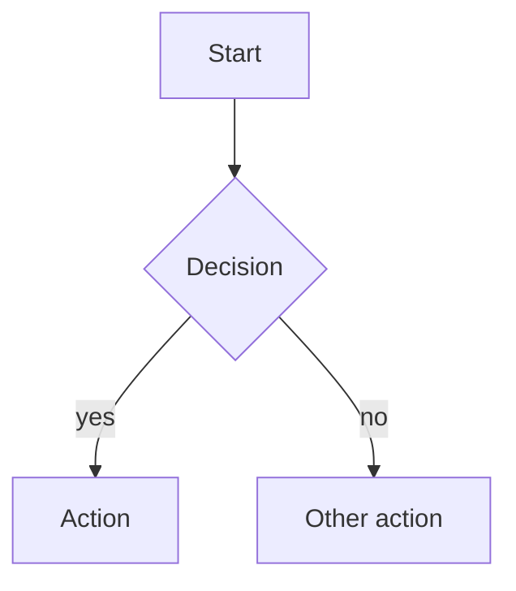

# Markdown Rendering

This is a format-rendering reference -- it describes how to render any
artifact in markdown, independent of which skill is producing it.

It is paired with a section contract (`plan-sections.md`,
`brainstorm-sections.md`, etc.) that describes *what* the artifact contains.
This reference describes *how* markdown specifically presents it.

## Hard invariants

These hold regardless of which skill produced the artifact.

- **YAML frontmatter at the top of the file.** Standard `---` delimited block
  containing the artifact's stable metadata (title, date, type, etc.).
- **ASCII identifiers in anchors.** Markdown headings auto-generate anchors
  from the heading text. Keep headings ASCII so anchors are predictable.
- **Repo-relative paths for file references.** Always. Never absolute paths.
- **No HTML mixed in.** Keep the markdown pure. No `<div>`, no `<details>`,
  no inline `<style>`.

## Format principles

### ID prefix format

Stable IDs (R, U, A, F, AE, KTD) appear as plain prefixes at the start of
the bullet or heading -- do NOT bold the prefix.

```markdown
- R1. The plan returns paginated sessions.   <- right
- **R1.** The plan returns paginated sessions.   <- wrong (bolded prefix)
```

### Content shape: prose vs bullets vs tables

- **Prose** when the content has narrative flow (motivation, decision
  rationale, problem framing).
- **Bullets** when items share a parallel shape but each carries enough
  prose to not fit a table cell.
- **Tables** when 5+ items share uniform structure (`ID + body`,
  `name + value`, `decision + rationale`, `risk + mitigation`).

### Bold leader labels within bullets

When a bullet has substructure, use bold leader labels at the start of
nested bullets -- not deeper heading levels.

```markdown
- F1. Anonymous capture
  - **Trigger:** Agent enters Step 2a with no session.
  - **Actors:** A1, A2
  - **Steps:** Preflight detects cloak; agent launches; capture proceeds.
  - **Covered by:** R1, R2, R5
```

### Section separators

For substantial artifacts, use horizontal rules (`---`) between top-level
H2 sections. Omit for short docs where separators would dominate.

## Section anatomy

- **Summary / Problem Frame** -- prose paragraphs.
- **Requirements** -- bullets with `R<N>.` prefix. When requirements span
  more than one concern, grouping under bold inline headers is the default.
- **Implementation Units** -- H3 heading per unit with `U<N>.` prefix.
  Fields render as bullets with bold leader labels.
- **Key Technical Decisions** -- bullets with bold decision name + prose
  rationale.
- **Key Flows / Acceptance Examples** -- bullets with bold leader labels.
- **Scope Boundaries** -- bullets, optionally split into sub-headings.

## Diagrams

When the section contract calls for a diagram, markdown renders it as
a fenced mermaid block:

```markdown

```

## No process exhaust

Engineering process metadata stays out of the artifact:
- No "captured at Phase X" notes
- No `## Next Steps` pointing to the next skill
- No italic provenance lines
- No engineering-flow shepherding

## Post-write audit

Before declaring the markdown file written, scan it for:

- All stable IDs are plain-prefix format, not bolded.
- No HTML elements mixed in.
- All file paths are repo-relative.
- Horizontal rule separators between H2s (for Standard / Deep artifacts).
- No process exhaust.
- Tables only where 5+ uniform-shape items justify them.
- Frontmatter has all the per-skill required fields with reasonable values.
